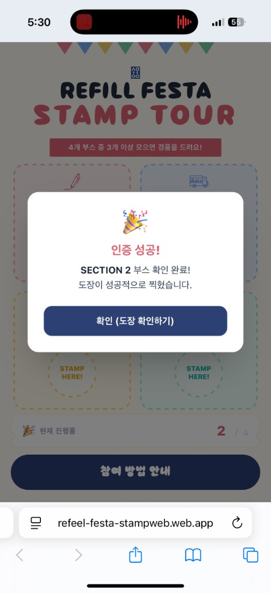
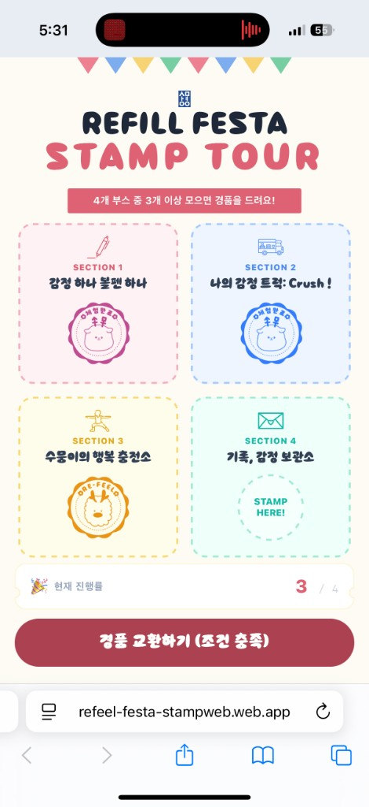
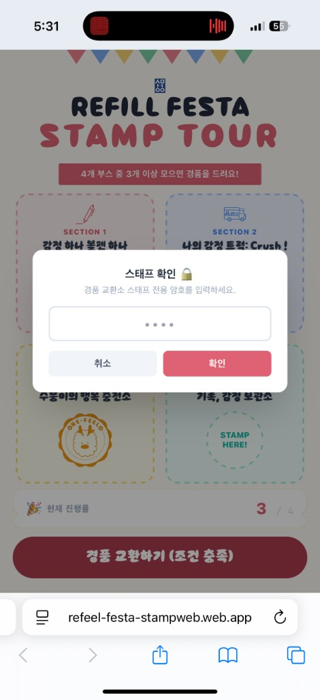
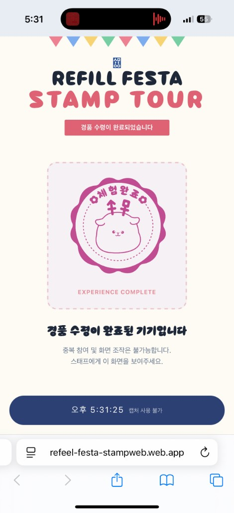
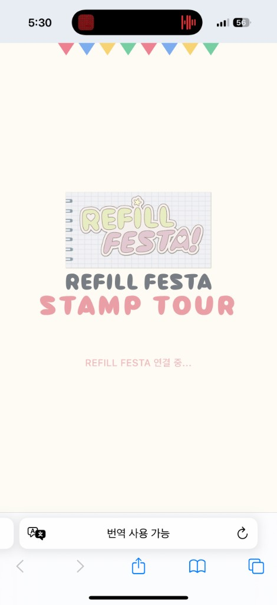
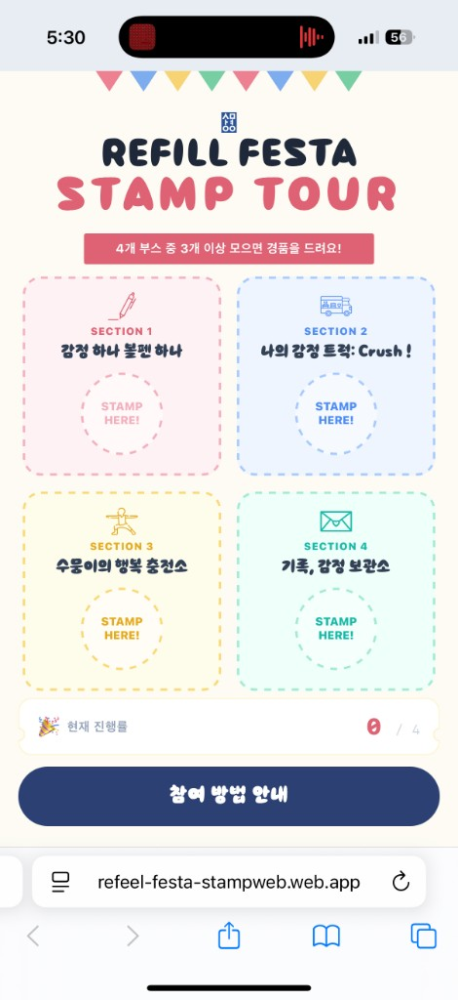
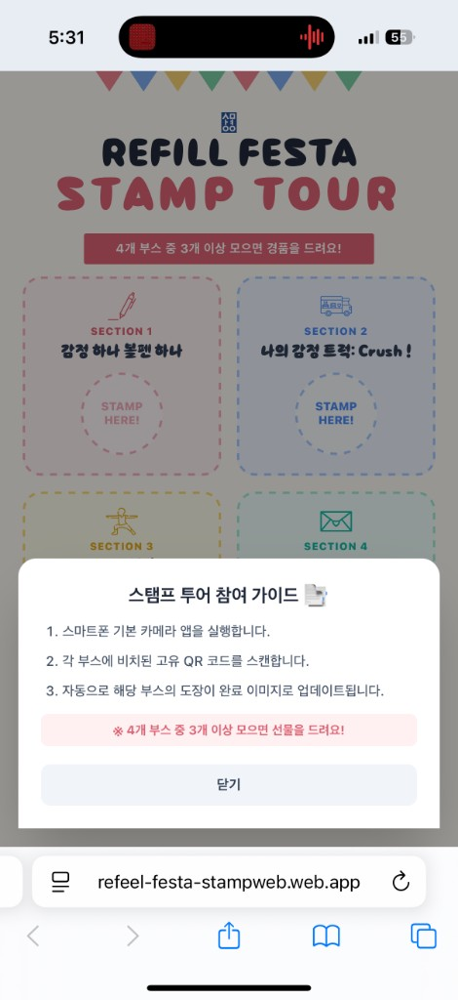

# REFILL FESTA STAMP TOUR

> 앱 설치 없이 QR 스캔만으로 부스 스탬프를 적립·경품 교환까지 처리하는 **모바일 웹 스탬프 투어**

[](https://refeel-festa-stampweb.web.app/)
[](https://react.dev/)
[](https://firebase.google.com/)

**배포** · [https://refeel-festa-stampweb.web.app/](https://refeel-festa-stampweb.web.app/)  
**행사** · 리필페스타 팝업스토어 (상명대) — **현장 실운영**  
**역할** · 기획 연동 · 프론트엔드 · Firebase 연동 · 보안 규칙 · 배포 · 현장 장애 대응  
**Last updated** · 2026-07-04

---

## 한 줄 요약

오프라인 팝업 현장에서 방문객이 **스마트폰 카메라로 QR을 스캔**하면 웹에서 스탬프가 자동 적립되고, **4부스 중 3개 이상** 수집 시 현장 스태프 인증 후 경품을 교환합니다. iOS 사파리의 **QR → 새 탭** 환경에서 발생한 세션 분리·도장 소실 버그를 해결해 **실제 행사 중 핫픽스 배포**까지 수행했습니다.

> **핵심 해결 사례** — 연속 QR 스캔 시 이전 도장이 사라지던 문제를  
> `authStateReady()` 세션 보장 + Firestore Transaction + **localStorage 도장 백업 병합**으로 해결했습니다.  
> UID가 바뀌어도 같은 기기에서는 `{1:true, 2:true}`가 누적·복구됩니다.

---

## 스크린샷

### 핵심 플로우

| QR 적립 성공 | 3/4 · 경품 버튼 활성화 | 스태프 인증 | 체험완료 잠금 |
|:---:|:---:|:---:|:---:|
|  |  |  |  |

### 전체 화면

| 로딩 | 메인 (0/4) | 참여 가이드 | QR 인증 성공 |
|:---:|:---:|:---:|:---:|
|  |  |  |  |

| 스탬프 3/4 | 스태프 인증 | 체험완료 |
|:---:|:---:|:---:|
|  |  |  |

*실제 iOS 사파리 · [refeel-festa-stampweb.web.app](https://refeel-festa-stampweb.web.app/) 캡처*

---

## 왜 이 프로젝트인가

| 현장 요구 | 구현 |
|-----------|------|
| 앱 설치·회원가입 없이 즉시 참여 | Firebase Anonymous Auth |
| QR 스캔 즉시 도장 반영 | `?section=1~4` + Firestore Transaction |
| 여러 부스를 돌아도 도장 유지 | UID 세션 보장 + 서버·로컬 도장 병합 |
| 경품 중복 수령 방지 | `isClaimed` 잠금 + 실시간 시계 체험완료 화면 |
| 스태프 현장 대응 | 수동 URL 백업, 스태프 가이드, 개발자 리셋 |

포트폴리오에서 강조하는 포인트는 **기능 구현만이 아니라**, 모바일 브라우저 특성을 진단하고 **실서비스 장애를 핫픽스로 막은 경험**입니다.

---

## 성과

- **현장 실운영** — 팝업스토어 행사 중 실제 방문객 트래픽으로 운영
- **프로덕션 핫픽스** — 행사 중 “이전 도장 소실” 신고 접수 → 원인 분석 → 빌드·배포까지 즉시 대응
- **데이터 무결성** — 연속 QR 스캔 시 `{1:true, 2:true}` 누적 (UID 분리 시에도 기기 백업으로 복구)
- **실시간 UI** — Firestore `onSnapshot`으로 새로고침 없이 스탬프 카드 동기화
- **보안 강화** — `allow read, write: if true` → 본인 문서 전용 규칙으로 교체·배포
- **운영 문서화** — 스태프 사용 설명서(`docs/STAFF_GUIDE.md`)로 현장 인수인계

---

## 기술 스택

| 구분 | 기술 |
|------|------|
| Frontend | React 19, Vite 8, Tailwind CSS 3 |
| Auth / DB | Firebase Anonymous Auth, Cloud Firestore |
| Hosting | Firebase Hosting (SPA rewrite) |
| Security | Firestore Security Rules (`firestore.rules`) |
| Ops | `.env.local` 기반 운영 암호, 스태프 가이드 |
| Tooling | ESLint, PostCSS |

---

## 주요 기능

1. **익명 인증** — `authStateReady()` 후 세션 복원, 없을 때만 1회 로그인
2. **QR 스탬프 적립** — `?section=1~4` → Transaction으로 도장 적립
3. **도장 백업·병합** — `localStorage`에 적립 상태를 저장해 UID 분리 시에도 복구
4. **실시간 스탬프 카드** — 4칸 UI, 섹션별 브랜드 컬러·아이콘
5. **경품 교환** — 3개 이상 수집 시 스태프 암호 인증 → `isClaimed` 잠금
6. **체험완료 화면** — 실시간 시계로 스크린샷 재사용 어뷰징 완화
7. **중복 스캔 안내** — 이미 완료된 부스 재스캔 시 토스트
8. **스태프 백업** — QR 오류 시 `?section=N` URL 수동 안내
9. **개발자 리셋** — 타이틀 5회 탭 + 관리자 인증 (현장 테스트용)

---

## 시스템 아키텍처

```
[부스 QR 스캔]  →  ?section=N
        │
        ▼
[ensureAnonymousUser]   authStateReady() → UID 재사용 또는 1회 익명 로그인
        │
        ▼
[applyStamp]            runTransaction
                        · Firestore stamps + localStorage 백업 병합
                        · 이번 섹션 true 적립
        │
        ├──────────────► localStorage (기기 단위 도장 백업)
        ▼
[Cloud Firestore]  ──onSnapshot──►  [React UI]
        ▲
[Security Rules]        본인 users/{uid}만 접근 · 3스탬프 이상만 claimed 허용
```

### 디렉터리 구조

```
src/
├── App.jsx                         # 메인 UI · 스탬프 파이프라인 · 로컬 백업 병합
├── services/
│   ├── firebase.js                 # Firebase 초기화 (.env)
│   └── auth.js                     # 익명 세션 보장 (authStateReady + 로그인 락)
├── components/
│   ├── Common/
│   │   ├── RibbonBanner.jsx
│   │   ├── SectionIcon.jsx
│   │   └── Toast.jsx
│   └── Layout/
│       ├── FestaHeader.jsx
│       ├── Garland.jsx
│       ├── LiveTimer.jsx
│       ├── LoadingScreen.jsx
│       └── PageShell.jsx
├── features/
│   └── reward/
│       └── ClaimedScreen.jsx
├── styles/
│   └── index.css
└── assets/

firestore.rules                     # Firestore 보안 규칙
firebase.json                       # Hosting + rules 설정
docs/
├── PRD.md                          # 기획 명세
├── STAFF_GUIDE.md                  # 현장 스태프 사용 설명서
└── screenshots/                    # 포트폴리오 스크린샷
```

### Firestore 스키마

```
users/{uid}
  ├── stamps: { 1: bool, 2: bool, 3: bool, 4: bool }
  ├── isClaimed: bool
  ├── createdAt: Timestamp
  ├── updatedAt: Timestamp
  └── claimedAt: Timestamp (경품 수령 시)
```

### 보안 규칙 요약

| 규칙 | 내용 |
|------|------|
| 읽기/쓰기 | 익명 로그인 사용자 **본인 `users/{uid}`만** |
| 경품 수령 | 스탬프 **3개 이상**일 때만 `isClaimed: true` 허용 |
| 수령 후 | 스탬프 추가 차단 (개발자 전체 리셋만 예외) |
| 삭제 | `users` 문서 삭제 불가 |

> 스태프·개발자 암호는 `.env.local`로 관리하며 Git에 포함하지 않습니다.  
> DB 전체 공개(`if true`) 수준의 위험은 규칙 배포로 제거했습니다.

---

## 트러블슈팅 (포트폴리오 핵심)

### 1. 연속 QR 스캔 시 이전 스탬프가 사라지는 문제

**증상**  
섹션1 스캔 후 `{1: true}` → 섹션2 스캔 후 `{1: false, 2: true}`. UI에서 도장 1이 사라짐.  
**행사 당일**에도 동일 증상 신고가 들어와 핫픽스로 대응했습니다.

**원인**

1. **UID 파편화** — iOS 사파리는 QR마다 새 탭을 엽니다. 세션 복원 전 `signInAnonymously()`가 호출되면 **매 스캔마다 새 UID**가 생성되고, 새 `users/{uid}` 문서에는 이번 도장만 남습니다.
2. **stamps 맵 전체 덮어쓰기** — 문서 없음으로 오판 시 `{1: false, 2: true, ...}` 형태로 전체 교체.
3. **레이스 컨디션** — `replaceState`를 Firestore 쓰기 전에 실행하면 Strict Mode 이중 실행 시 빈 장부 `setDoc` 발생.

**해결 (다층 방어)**

```js
// 1) auth.js — 세션 복원 대기 후 1회만 로그인
await auth.authStateReady();
if (!auth.currentUser) await signInAnonymously(auth);

// 2) App.jsx — 서버 stamps + localStorage 백업 병합 후 적립
const before = mergeStamps(serverStamps, loadLocalStamps());
const next = { ...before, [sectionId]: true };
saveLocalStamps(next);
transaction.update(userDocRef, { stamps: next, updatedAt: serverTimestamp() });
```

| 레이어 | 역할 |
|--------|------|
| `authStateReady()` + 로그인 락 | 같은 브라우저에서 UID 재사용 |
| `runTransaction` | 동시 쓰기·레이스 방지 |
| `localStorage` 백업 병합 | UID가 바뀌어도 **같은 기기**에서 이전 도장 복구 |
| `replaceState` 지연 | 쓰기 성공 후에만 URL 정리 |

**결과** — 동일 UID에서는 정상 누적, UID가 분리돼도 기기 백업으로 `{1:true, 2:true}` 복구. 행사 중 핫픽스 배포 완료.

### 2. Firestore 보안 규칙 전면 개방

**증상** — 초기 규칙 `allow read, write: if true`로 누구나 전체 DB 접근 가능.

**해결** — `firestore.rules` 작성 후 `firebase deploy --only firestore:rules` 배포.  
본인 문서만 접근, 스탬프 3개 미만 `isClaimed` 차단.

### 3. 모바일 웹뷰 UX

브라우저 `alert()`는 웹뷰에서 메인 스레드를 블로킹할 수 있어, 성공 모달·토스트·스태프 인증 UI를 React 상태 기반으로 전환했습니다.

---

## UI / 브랜딩

- **타이포** — SinchonRhapsody 커스텀 폰트 (`font-sinchon`)
- **컬러** — 부스별 4색 팔레트 + `festa.*` 브랜드 컬러 (Tailwind extend)
- **레이아웃** — `PageShell` + `FestaHeader` + `Garland`로 행사 톤 통일
- **스탬프 카드** — `aspect-square` 그리드, Scroll-Free 단일 뷰포트

| 섹션 | 부스명 | 배경 |
|------|--------|------|
| 1 | 감정 하나 볼펜 하나 | `#f6f1f4` |
| 2 | 나의 감정 트럭: Crush ! | `#ecc4cd` |
| 3 | 수뭉이의 행복 충전소 | `#d7eef9` |
| 4 | 기록, 감정 보관소 | `#b7d6f1` |

---

## Firebase 무료 요금 (Spark 플랜)

팝업스토어·교내 축제 규모에서는 **기본 무료 요금으로 충분**한 경우가 대부분입니다.

| 항목 | Spark(무료) 일일 한도 | 참가자 1명당 대략 |
|------|----------------------|-------------------|
| Firestore 읽기 | 50,000회 | 15~25회 |
| Firestore 쓰기 | 20,000회 | 5~8회 |
| Anonymous Auth | 무제한 | 1회 |
| Hosting 전송 | 360MB/일 | 정적 파일 수 MB |

하루 **약 2,000~3,000명** 수준까지 여유가 있습니다. 대규모가 예상되면 Blaze(종량제)로 전환해도 무료 한도까지는 과금되지 않습니다.

---

## 로컬 실행

### 사전 요구

- Node.js 18+
- Firebase 프로젝트 (Anonymous Auth · Firestore 활성화)

### 환경 변수

`.env.example`을 복사해 `.env.local`을 생성합니다. **`.env.local`은 Git에 올리지 않습니다.**

```bash
cp .env.example .env.local   # Windows: copy .env.example .env.local
```

```env
VITE_FIREBASE_API_KEY=
VITE_FIREBASE_AUTH_DOMAIN=
VITE_FIREBASE_PROJECT_ID=
VITE_FIREBASE_STORAGE_BUCKET=
VITE_FIREBASE_MESSAGING_SENDER_ID=
VITE_FIREBASE_APP_ID=

# 현장 운영용 (저장소·GitHub에 실제 값 기재 금지)
VITE_STAFF_PASSWORD=
VITE_DEV_RESET_PASSWORD=
```

> 배포 시 `npm run build`가 `.env.local` 값을 번들에 포함합니다. 암호 변경 후에는 **재빌드·재배포**가 필요합니다.

### 명령어

```bash
npm install
npm run dev       # http://localhost:5173
npm run build
npm run preview
npm run lint
```

### QR 스탬프 테스트

```
http://localhost:5173/?section=1
http://localhost:5173/?section=2
http://localhost:5173/?section=3
http://localhost:5173/?section=4
```

같은 브라우저에서 1 → 2 순서로 열어 **두 도장이 모두 유지**되는지 확인합니다.

---

## 배포

```bash
npm run build
firebase deploy --only hosting
firebase deploy --only firestore:rules
# 또는
firebase deploy
```

`firebase.json` — `dist` SPA rewrite, `firestore.rules` 연동.

---

## 관련 문서

- [docs/PRD.md](./docs/PRD.md) — 기획 명세, 부스 구성, 예외 처리 가이드
- [docs/STAFF_GUIDE.md](./docs/STAFF_GUIDE.md) — 현장 스태프·경품 교환 담당자 사용 설명서

---

## 라이선스

본 프로젝트는 포트폴리오·행사 운영 목적으로 제작되었습니다.
